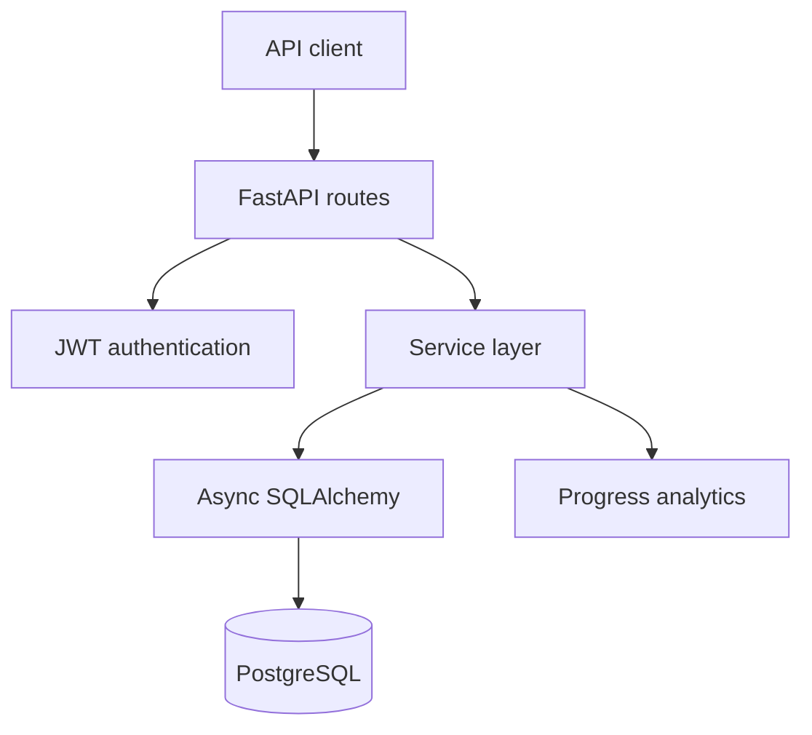

# Gym Progress Tracker API

[](https://github.com/Roman-Prodeus07/gym-progress-tracker-api/actions/workflows/ci.yml)


A production-oriented FastAPI and PostgreSQL backend for secure workout
tracking, detailed training history and timezone-aware progress analytics.

This is my flagship backend portfolio project. It demonstrates authenticated
multi-user API design, ownership isolation, asynchronous database access,
non-trivial analytics, automated testing and CI-backed delivery.

## What this project demonstrates

- Secure JWT authentication with Argon2id password hashing
- Owner-isolated workout data enforced at the database-query layer
- Normalised relational modelling for workouts, exercises and sets
- Timezone-aware, DST-safe analytics using IANA timezones
- Deterministic personal records and per-exercise progression
- 285 automated tests, including PostgreSQL-backed coverage
- Reproducible Docker builds and locked Python dependencies
- CI gates for formatting, linting, type checking, tests, migrations and the
  production container

## Core capabilities

| Area | Capabilities |
| --- | --- |
| Authentication | Registration, OAuth2 password login, signed JWT access tokens and protected user endpoints |
| Exercise catalogue | Authenticated, paginated access to an idempotently seeded exercise catalogue |
| Workout tracking | Owner-scoped CRUD for workout sessions, ordered exercises and nested sets |
| Training history | Reverse-chronological history, timestamp filters and complete nested workout responses |
| Progress analytics | Day, week and month summaries with volume, duration, distance, RPE and active-day metrics |
| Personal records | Maximum weight, repetitions, set volume, estimated 1RM, distance, duration and pace |
| Exercise progression | Chronological strength, cardio, volume, pace and RPE data for individual exercises |

## Architecture



The application is split into API, service, schema, model and database layers.
`WorkoutSession` is the aggregate root for user-owned training data, while
catalogue exercises remain global and reusable.

## Engineering decisions

### Ownership and API security

The authenticated user's UUID is applied directly in database queries. Clients
cannot provide or override resource ownership. Missing and foreign resource IDs
return the same `404 Not Found` response, reducing resource-enumeration risk.

JWT validation checks the signature, allowed algorithm, token type, expiry,
issuer, audience and subject. Unknown login emails still perform dummy password
verification to reduce observable timing differences.

### Timezone-aware analytics

Analytics accept an IANA timezone such as `Europe/London`. Local date boundaries
are converted into an exclusive UTC query range, so day, week and month reports
remain correct across daylight-saving transitions.

### Data integrity

Database constraints protect ordering, time ranges, supported set types and
training metrics independently of API validation. Child workout records use
database cascades, while referenced catalogue exercises are preserved.

Personal-record ties are resolved deterministically using workout time,
exercise position, set number and UUID.

## Quality and delivery

The current baseline is **285 passing automated tests**. The CI workflow runs
against PostgreSQL and enforces:

- `ruff format --check .`
- `ruff check .`
- `mypy` across `app` and `alembic`
- `pytest`
- Alembic upgrade, schema check, downgrade and re-upgrade validation
- installation from locked dependencies
- production Docker image build and `pip check`
- verification that the runtime container uses a non-root user

## Technology stack

- **Language:** Python 3.13
- **API:** FastAPI, Pydantic and PyJWT
- **Database:** PostgreSQL 18, SQLAlchemy 2, Psycopg 3 and Alembic
- **Security:** Argon2id password hashing and OAuth2-compatible JWT authentication
- **Testing and quality:** pytest, Ruff and mypy
- **Delivery:** Docker, Docker Compose, locked dependencies and GitHub Actions

## Quick start with Docker

### 1. Clone the repository

```bash
git clone https://github.com/Roman-Prodeus07/gym-progress-tracker-api.git
cd gym-progress-tracker-api
```

### 2. Configure the environment

```bash
cp .env.example .env
openssl rand -hex 32
```

Copy the generated value into `JWT_SECRET_KEY` in `.env`. The example values
are for local development only and must not be reused in production.

### 3. Start the services

```bash
docker compose up --build -d
docker compose exec api alembic upgrade head
docker compose exec api python -m app.scripts.seed_exercises
```

### 4. Explore the API

- Swagger UI: <http://localhost:8000/docs>
- OpenAPI schema: <http://localhost:8000/openapi.json>
- Liveness: <http://localhost:8000/health>
- Database readiness: <http://localhost:8000/health/ready>

Stop the services with:

```bash
docker compose down
```

The PostgreSQL data remains in the named Docker volume.

## API overview

All workout and progress endpoints require a Bearer access token.

For complete request and response examples, validation rules and endpoint behaviour, see the [detailed API reference](docs/API_REFERENCE.md).

| Method | Endpoint | Purpose |
| --- | --- | --- |
| `POST` | `/auth/register` | Register a user |
| `POST` | `/auth/login` | Issue a JWT access token |
| `GET` | `/users/me` | Return the authenticated user |
| `GET` | `/exercises` | List catalogue exercises |
| `POST`, `GET` | `/workouts` | Create or list owned workouts |
| `GET`, `PATCH`, `DELETE` | `/workouts/{workout_id}` | Read, update or delete an owned workout |
| `POST`, `GET` | `/workouts/{workout_id}/exercises` | Add or list workout exercises |
| `POST`, `GET` | `/workouts/{workout_id}/exercises/{workout_exercise_id}/sets` | Add or list workout sets |
| `GET` | `/progress/summary` | Return period totals and time buckets |
| `GET` | `/progress/personal-records` | Return strength and cardio records |
| `GET` | `/progress/exercises/{exercise_id}` | Return per-exercise progression |

FastAPI generates the complete interactive endpoint and schema documentation at
`/docs` and `/openapi.json`.

## Local development

Create a virtual environment and install the application with development
dependencies:

```bash
python3 -m venv .venv
source .venv/bin/activate
python -m pip install -e ".[dev]"
```

Start PostgreSQL, apply migrations and seed the catalogue:

```bash
docker compose up -d db
alembic upgrade head
python -m app.scripts.seed_exercises
```

Run the API:

```bash
fastapi dev app/main.py
```

Run the local quality checks:

```bash
ruff format --check .
ruff check .
mypy
pytest
```

## Project structure

```text
.
├── app/
│   ├── api/          # Routes and request dependencies
│   ├── core/         # Configuration and security
│   ├── db/           # Async database engine and sessions
│   ├── models/       # SQLAlchemy domain models
│   ├── schemas/      # Pydantic request and response schemas
│   ├── scripts/      # Idempotent catalogue seeding
│   └── services/     # Business logic and analytics
├── alembic/          # Database migrations
├── tests/            # Unit, API and PostgreSQL-backed tests
├── .github/workflows/ci.yml
├── compose.yaml
├── Dockerfile
├── pyproject.toml
└── requirements.lock
```

## Status and roadmap

The current portfolio release is feature-complete and validated locally and in
CI. The API is not currently deployed as a public service; it can be run locally
with Docker Compose.

Potential future extensions:

- refresh-token rotation and logout/revocation
- workout templates and reusable training plans
- body measurements and trend analytics
- production deployment, monitoring and observability

## Author

**Roman Prodeus**

Computer Science (Artificial Intelligence) student at the University of
Greenwich, seeking a 2027 UK Software Engineering placement.

[GitHub profile](https://github.com/Roman-Prodeus07) ·
[LinkedIn](https://www.linkedin.com/in/roman-prodeus-3726172b2)
